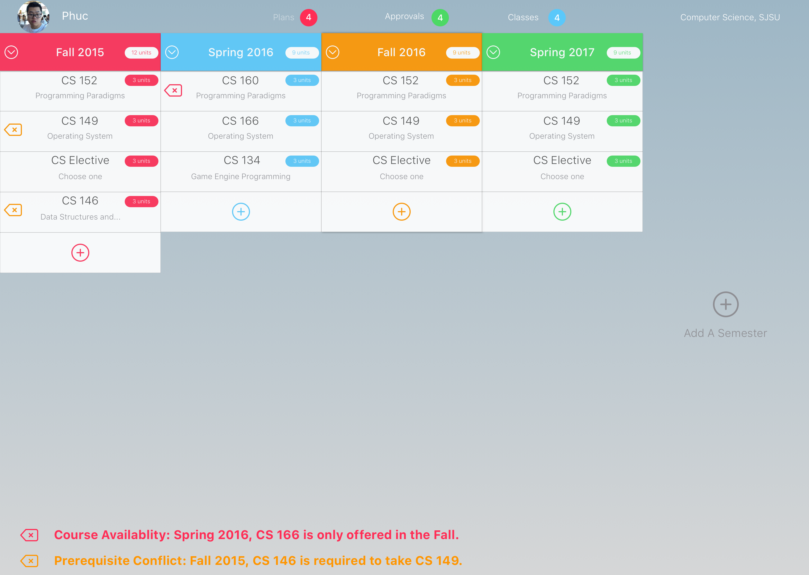
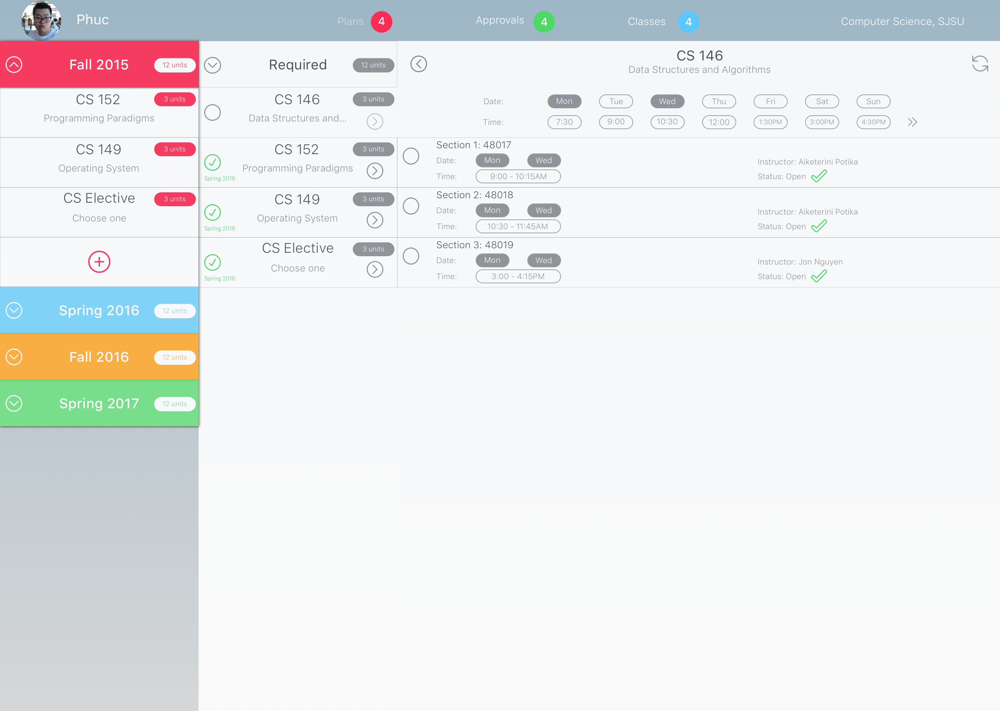
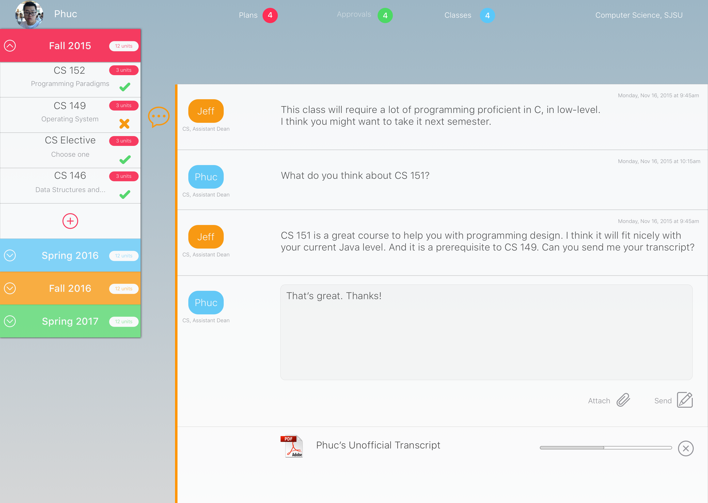

# Planista - SJSU Innovation Challenge 2015 Finalist
### Description
Planista is web app that helps student organize their academic plans and classes efficiently. It also helps student chat with their academic advisors directly, get their feedbacks or approvals without making any appointments or waiting in line. Advisors now have the ability to track their student's records, plans, previous conversations so that they can help students prevent any mistakes which a freshman or a transfer might make.

---
### Designs
##### Student Planning

